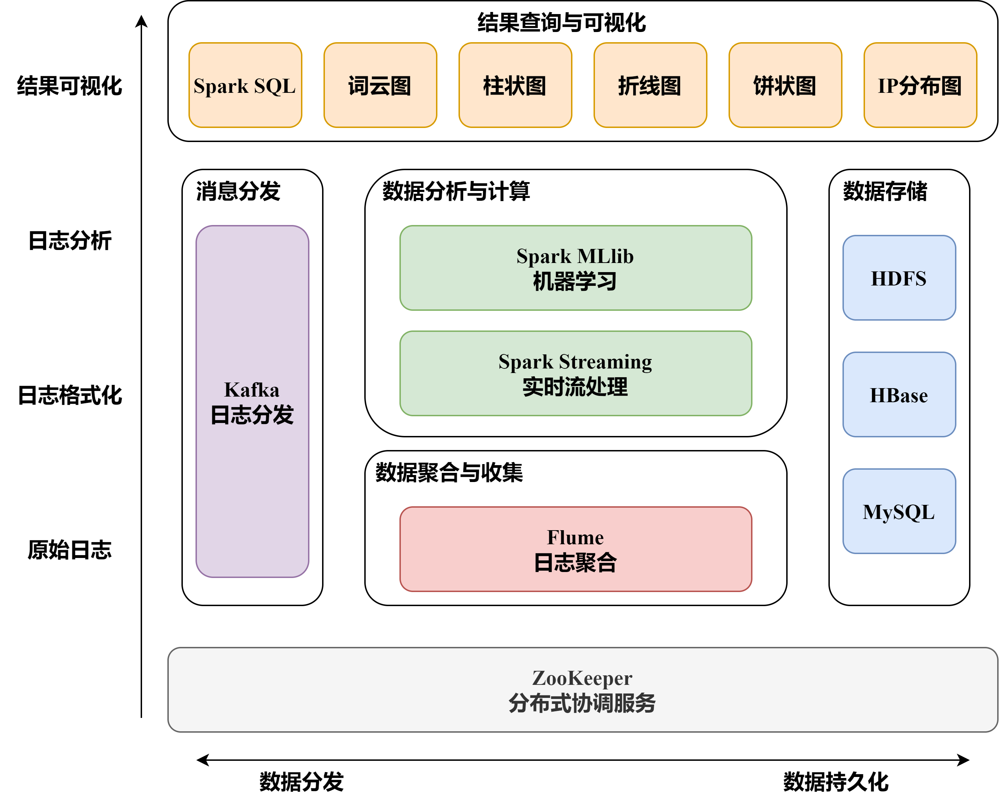
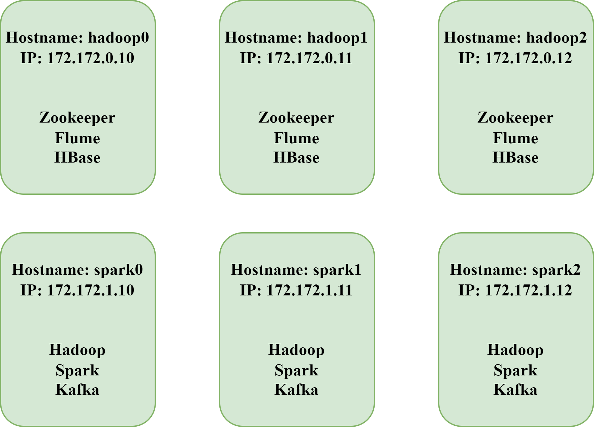

# 基于大数据的日志分析系统

- **数据来源**：https://www.kaggle.com/datasets/eliasdabbas/web-server-access-logs
  （购物网站www.zanbil.ir的访问日志）
- **项目介绍**：使用实时日志模拟脚本采集数据集日志，实时分析流采用流水线Flume+Kafka+SparkStreaming进行实时日志的收集，离线分析流采用Flume+HDFS+PySpark进行日志的处理，最后通过HBase与MySQL进行数据的存储
- **项目环境**：
  - Scala：2.13
  - Zookeeper集群：3.4.14
  - hadoop集群：2.7.7
  - Flume集群：1.9.0
  - Kafka集群：2.4.0
  - HBase集群：0.98.17
  - Spark集群：2.4.4
  - MySQL：8.0.11

### 项目架构图

### 项目结构
  - img：存放项目的图片相关内容
  - src/main/scala/com/log/offline：离线分析代码
  - src/main/scala/com/log/realtime：实时分析代码
  - src/main/scala/com/log/utils：工具类代码
  - src/main/scala/assembly.xml：项目打包配置文件
### 镜像

Docker Hub：https://hub.docker.com/repository/docker/zhaotianxiang/bigdata/general

可以在Docker Hub中下载本次项目用到的6个镜像

命令：

```bash
docker pull zhaotianxiang/bigdata:hadoop0
docker pull zhaotianxiang/bigdata:hadoop1
docker pull zhaotianxiang/bigdata:hadoop2
docker pull zhaotianxiang/bigdata:spark0
docker pull zhaotianxiang/bigdata:spark1
docker pull zhaotianxiang/bigdata:spark2
```


**镜像架构图**

### 使用步骤

- 启动容器：

  ```sh
  # 构建网桥
  sudo docker network create --subnet=172.172.0.0/24 docker-bigdata-br0
  sudo docker network create --subnet=172.172.1.0/24 docker-bigdata-br1
  # 从镜像创建容器
  sudo docker run -itd --network=docker-bigdata-br0 --ip 172.172.0.10 --name=hadoop0 --hostname=hadoop0 -P -p 50070:50070 -p 8088:8088 -p 7077:7077 -p 8081:8081 -p 4040:4040 hadoop_0
  sudo docker run -itd --network=docker-bigdata-br0 --ip 172.172.0.11 --name=hadoop1 --hostname=hadoop1 -P hadoop_1
  sudo docker run -itd --network=docker-bigdata-br0 --ip 172.172.0.12 --name=hadoop2 --hostname=hadoop2 -P hadoop_2
  sudo docker run -itd --network=docker-bigdata-br1 --ip 172.172.1.10 --name=spark0 --hostname=spark0 -P -p 9099:9099 spark_0
  sudo docker run -itd --network=docker-bigdata-br1 --ip 172.172.1.11 --name=spark1 --hostname=spark1 -P -p 9098:9098 spark_1
  sudo docker run -itd --network=docker-bigdata-br1 --ip 172.172.1.12 --name=spark2 --hostname=spark2 -P spark_2
  # 启动容器
  sudo docker exec -it hadoop0 bash
  sudo docker exec -it hadoop1 bash
  sudo docker exec -it hadoop2 bash
  sudo docker exec -it spark0 bash
  sudo docker exec -it spark1 bash
  sudo docker exec -it spark2 bash
  # 网桥互连通
  sudo docker network connect docker-bigdata-br0 spark0
  sudo docker network connect docker-bigdata-br0 spark1
  sudo docker network connect docker-bigdata-br0 spark2
  sudo docker network connect docker-bigdata-br1 hadoop0
  sudo docker network connect docker-bigdata-br1 hadoop1
  sudo docker network connect docker-bigdata-br1 hadoop2
  ```

- 设置容器host：

  - hadoop0、hadoop1、hadoop2：

    ```sh
    # 分别执行
    sudo docker exec -it hadoop0 bash
    cd ~
    sh run_host.sh
    ```

  - spark1、spark2、spark3：

    ```sh
    sudo docker exec -it spark1 bash
    vi /etc/hosts
    # 删除自带的ip！！添加如下语句
    172.172.1.10       spark0
    172.172.1.11       spark1
    172.172.1.12       spark2
    172.172.0.10       hadoop0
    172.172.0.11       hadoop1
    172.172.0.12       hadoop2
    # 保存退出
    ```

- 启动Zookeeper集群：

  ```sh
  sudo docker exec -it hadoop0 bash                      #进入主节点容器
  cd ~/zookeeper-3.4.7/bin
  sh zkServer.sh start
  exit
  
  sudo docker exec -it hadoop1 bash                      #进入hadoop1
  cd ~/zookeeper-3.4.7/bin
  sh zkServer.sh start
  exit
  
  sudo docker exec -it hadoop2 bash                      #进入hadoop2
  cd ~/zookeeper-3.4.7/bin
  sh zkServer.sh start
  exit
  ```

- 启动hadoop集群：

  ```sh
  sudo docker exec -it spark0 bash                      #进入主节点容器
  cd /usr/local/hadoop/
  sh /usr/local/hadoop/sbin/start-all.sh
  ```

- 启动Flume集群:
  ```sh
   /usr/local/flume/bin/flume-ng agent -n a1 -c /usr/loacl/flume/conf -f /usr/local/flume/conf/flume-conf.properties -Dflume.root.logger=INFO,console
  ```


- 启动HBase集群：

  ```sh
  sudo docker exec -it spark0 bash                      #进入主节点容器
  sh /usr/local/hbase/bin/start-hbase.sh
  ```

- 启动Spark集群：

  ```sh
  sudo docker exec -it spark0 bash 
  cd home/softwares/spark-2.4.4-bin-hadoop2.7/sbin/
  sh /start-all.sh
  ```

- 启动KafKa集群：

  ```sh
  sudo docker exec -it spark0 bash
  sh kafka_2.12-2.6.0/bin/kafka-server-start.sh -daemon kafka_2.12-2.6.0/config/server.properties
  exit
  
  sudo docker exec -it spark1 bash
  sh kafka_2.12-2.6.0/bin/kafka-server-start.sh -daemon kafka_2.12-2.6.0/config/server.properties
  exit
  
  sudo docker exec -it spark2 bash
  sh kafka_2.12-2.6.0/bin/kafka-server-start.sh -daemon kafka_2.12-2.6.0/config/server.properties
  exit
  ```

- 启动实时日志采集


- 运行代码：

  - 清理环境，打包代码

    ```sh
    # 执行Maven 清理
    cd /home/log-demo-master/Spark-clear-data
    echo "执行 Maven 清理..."
    mvn clean
    # 执行 Maven 打包
    echo "执行 Maven 打包..."
    mvn package assembly:single
    ```

  - 将日志数据进行清洗和数据库采集接口

    ```sh
    spark-submit \
    --master spark://172.172.1.10:9099 \
    --conf spark.driver.host=172.172.1.10 \
    --class com.log.realtime.LogData \
    --executor-memory 512M \
    /home/log-demo-master/Spark-clear-data/target/clear-data-demo-release.jar
    ```

  - 用户活跃度

    ```sh
    spark-submit \
    --master spark://172.172.1.10:9099 \
    --conf spark.driver.host=172.172.1.10 \
    --class com.log.realtime.ActiveUser \
    --executor-memory 512M \
    /home/log-demo-master/Spark-clear-data/target/clear-data-demo-release.jar
    ```

  - Url的Http分析

    ```sh
    spark-submit \
    --master spark://172.172.1.10:9099 \
    --conf spark.driver.host=172.172.1.10 \
    --class com.log.realtime.UrlHttp \
    --executor-memory 512M \
    /home/log-demo-master/Spark-clear-data/target/clear-data-demo-release.jar
    ```

  - Url的Method分析

    ```sh
    spark-submit \
    --master spark://172.172.1.10:9099 \
    --conf spark.driver.host=172.172.1.10 \
    --class com.log.realtime.UrlMethod \
    --executor-memory 512M \
    /home/log-demo-master/Spark-clear-data/target/clear-data-demo-release.jar
    ```

  - Url的状态码分析

    ```sh
    spark-submit \
    --master spark://172.172.1.10:9099 \
    --conf spark.driver.host=172.172.1.10 \
    --class com.log.realtime.UrlStatus \
    --executor-memory 512M \
    /home/log-demo-master/Spark-clear-data/target/clear-data-demo-release.jar
    ``` 
  - 热度排行：页面访问量统计：
    ```sh
    spark-submit \
    --master spark://172.172.1.10:9099 \
    --conf spark.driver.host=172.172.1.10 \
    --class com.log.realtime.PRAnalysis \
    --executor-memory 512M \
    /home/log-demo-master/Spark-clear-data/target/clear-data-demo-release.jar
    ```
  - 热度排行：来源网址统计：

    ```sh
    spark-submit \
    --master spark://172.172.1.10:9099 \
    --conf spark.driver.host=172.172.1.10 \
    --class com.log.realtime.RefAnalysis \
    --executor-memory 512M \
    /home/log-demo-master/Spark-clear-data/target/clear-data-demo-release.jar
    ```

  - 用户代理与客户端配置统计：

    ```sh
    spark-submit \
    --master spark://172.172.1.10:9099 \
    --conf spark.driver.host=172.172.1.10 \
    --class com.log.realtime.AgentAnalysis \
    --executor-memory 512M \
    /home/log-demo-master/Spark-clear-data/target/clear-data-demo-release.jar
    ```

  - 每小时的独立ip统计：当前批次不重复的ip总数

    ```sh
    spark-submit \
    --master spark://172.172.1.10:9099 \
    --conf spark.driver.host=172.172.1.10 \
    --class com.log.realtime.TimeAnalysis \
    --executor-memory 512M \
    /home/log-demo-master/Spark-clear-data/target/clear-data-demo-release.jar
    ```
  - k-means数据聚类分析

    ```sh
    spark-submit \
    --master spark://172.172.1.10:9099 \
    --conf spark.driver.host=172.172.1.10 \
    --py-files bigdata/src/main/scala/com/log/cluster_vision.py \
    bigdata/src/main/scala/com/log/cluster.py
    ```
  - 按 IP 地址聚合数据进行数据聚类

    ```sh
    spark-submit \
    --master spark://172.172.1.10:9099 \
    --conf spark.driver.host=172.172.1.10 \
    --py-files bigdata/src/main/scala/com/log/ip_cluster_vision.py \
    bigdata/src/main/scala/com/log/ip_cluster.py
    ```
  - IP地址分布地图
    ```sh
    spark-submit \
    --master spark://172.172.1.10:9099 \
    --conf spark.driver.host=172.172.1.10 \
    --py-files bigdata/src/main/scala/com/log/ip_analysis_vision.py \
    bigdata/src/main/scala/com/log/ip_analysis.py
    ```

    

